# Mermaid Diagrams

## Flowcharts
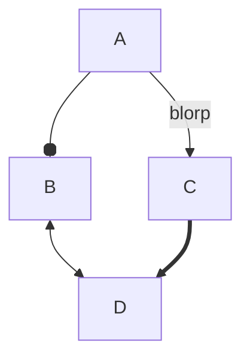

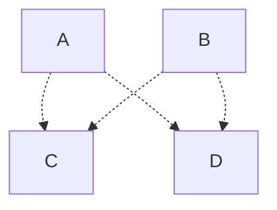
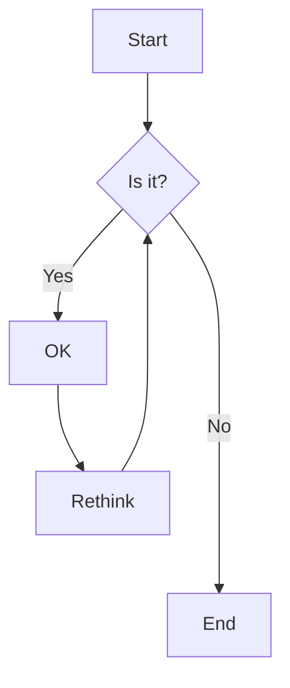
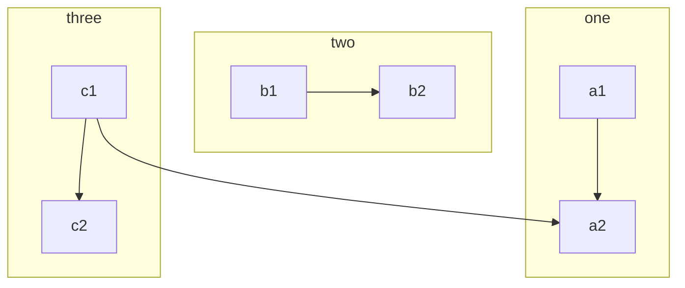

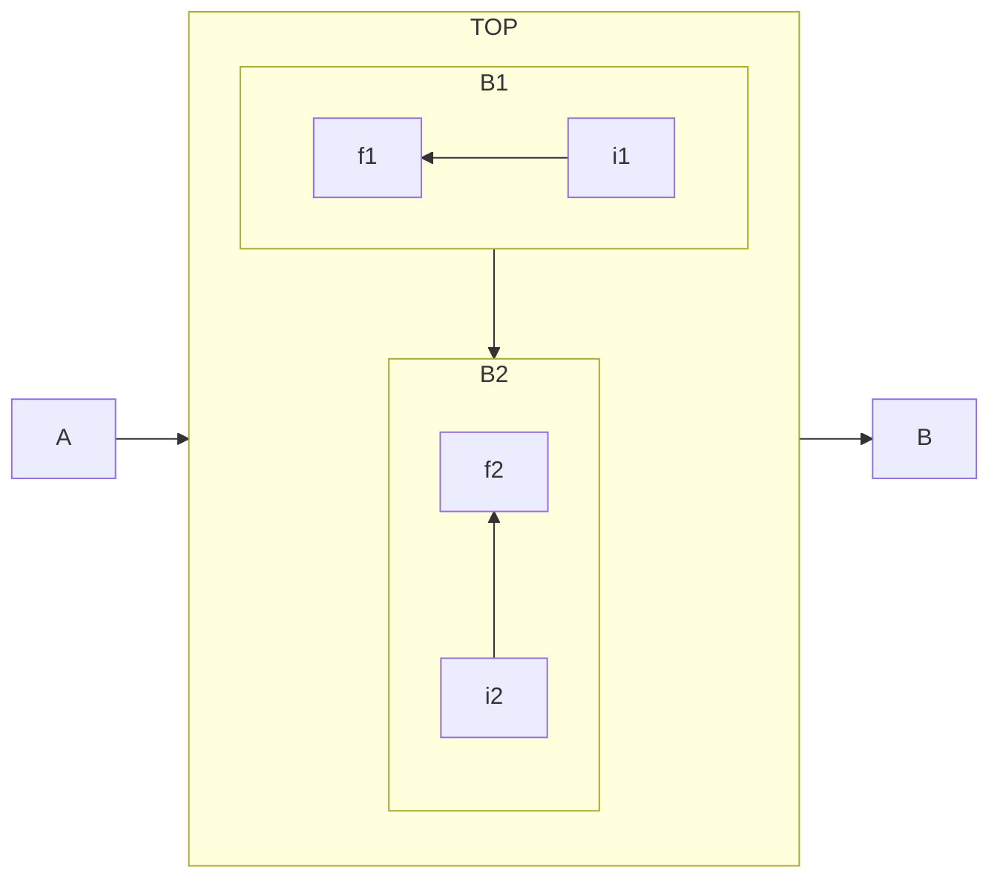

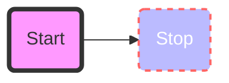

## Sequence Diagram
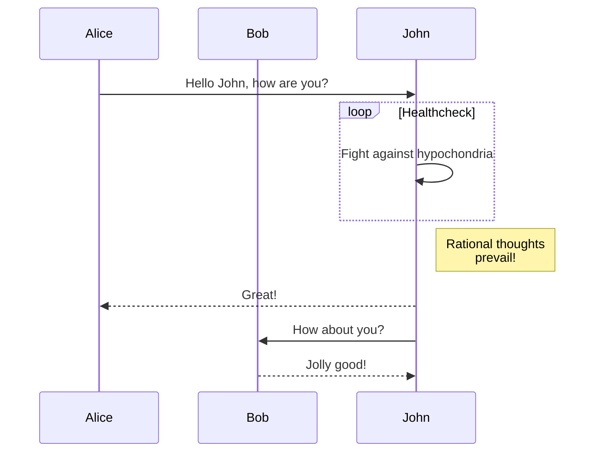

## Gantt
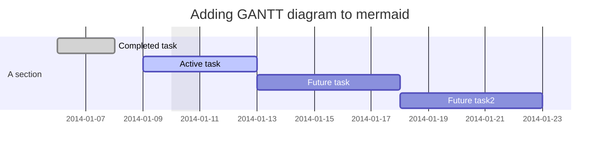

## Class Diagram
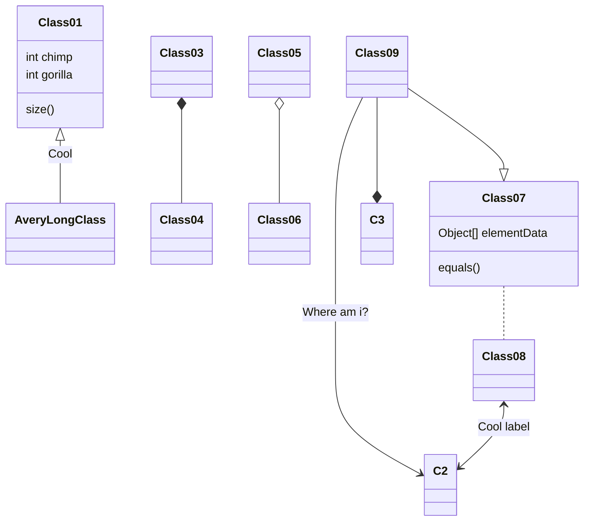

## git graph
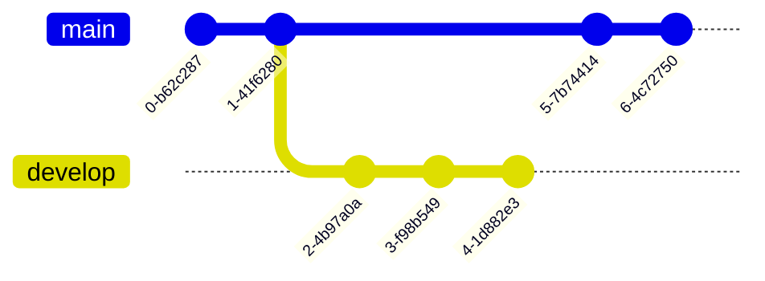

## Entity Relationship Diagram
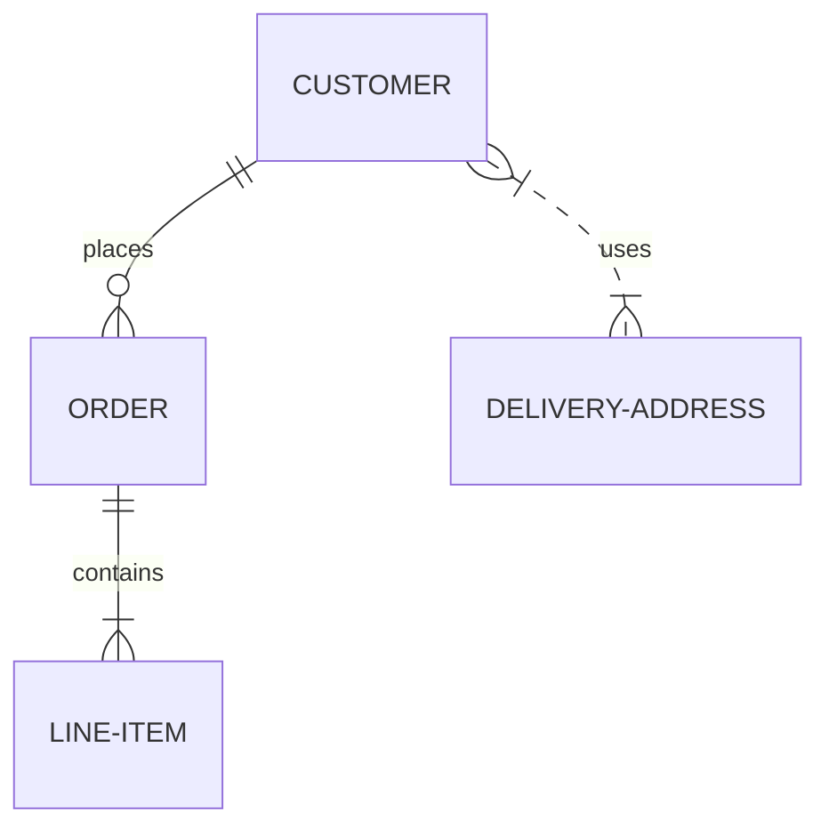

## user journey diagram
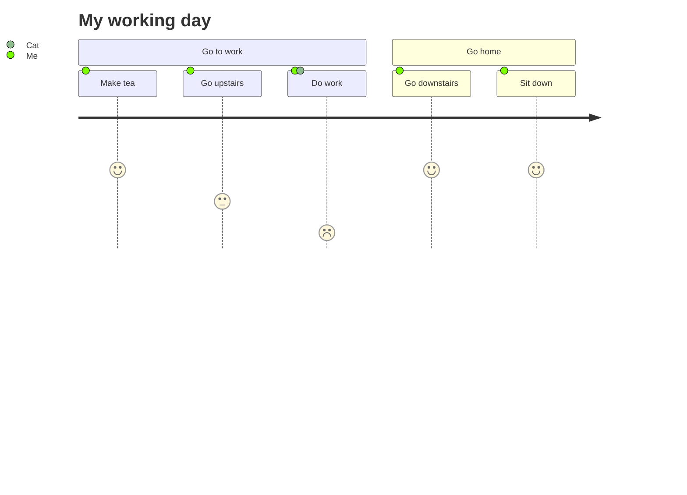

# mermaid CLI
```bash
npm install -g @mermaid-js/mermaid-cli
mmdc -i input.mmd -o output.svg
mkdir svg
mv *.svg svg
```
